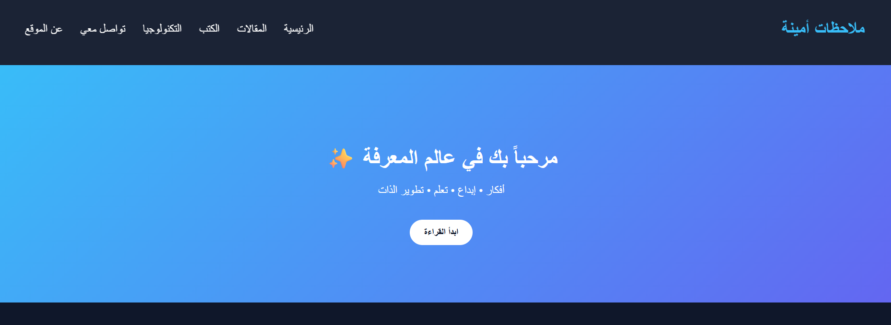
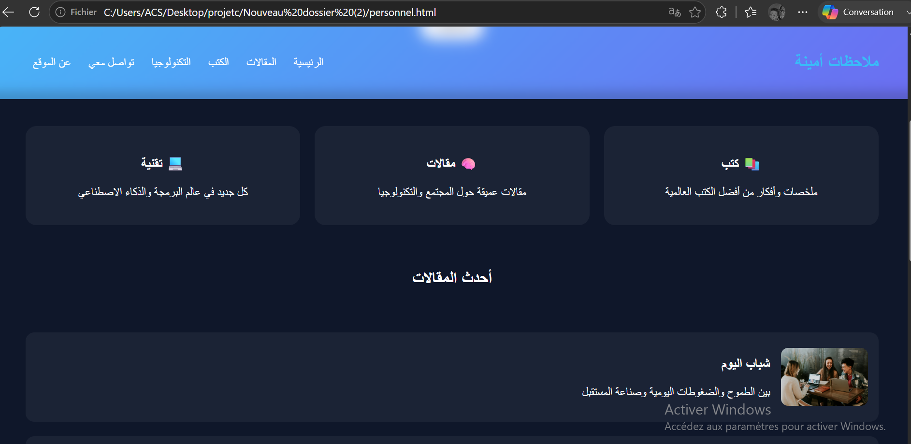
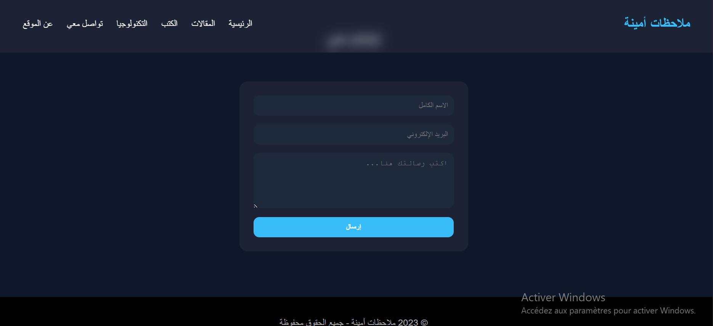
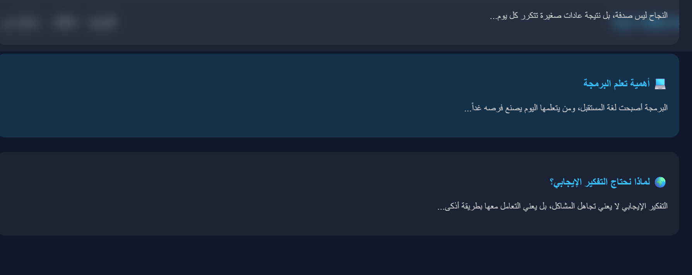

# Blogger Website 📝

Site web de type blog dédié à la publication d’articles et de contenus variés, avec une interface simple et organisée pour faciliter la lecture.

## 🔧 Technologies

HTML, CSS, JavaScript

## ✨ Fonctionnalités

* Affichage des articles
* Interface claire et lisible

## 📌 Description

Ce projet a été réalisé pour créer une plateforme de blog permettant de partager des articles et du contenu écrit. L’accent a été mis sur la simplicité du design et l’expérience utilisateur.

## 🚧 État du projet

Projet en évolution avec possibilité d’ajouter un système dynamique (base de données, gestion des articles).

